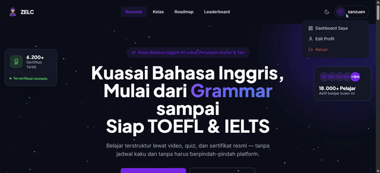
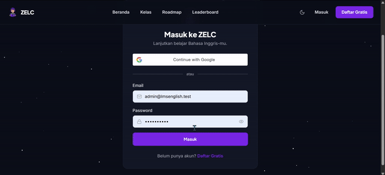
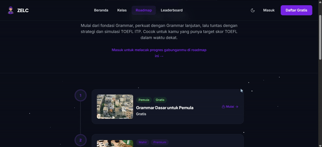
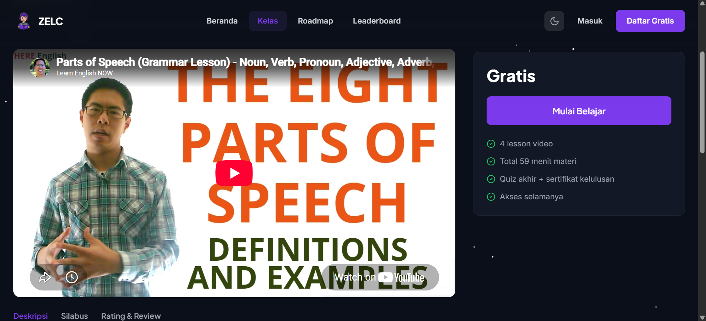
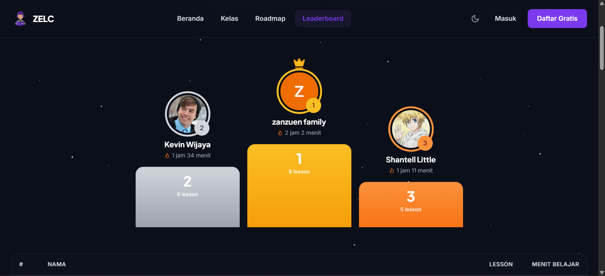
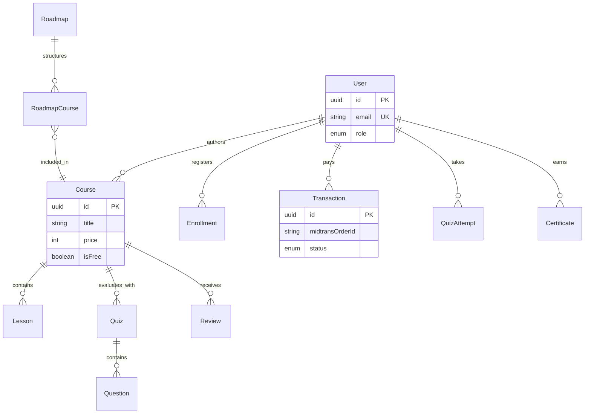

# ZELC LMS — Zanzuen English Learning Center
> **Platform Pembelajaran Kursus Bahasa Inggris Berbasis Web (Full-Stack Monorepo)**

[](https://react.dev/)
[](https://www.typescriptlang.org/)
[](https://vitejs.dev/)
[](https://tailwindcss.com/)
[](https://expressjs.com/)
[](https://www.prisma.io/)
[](https://www.postgresql.org/)
[](https://midtrans.com/)

---

## 1. Project Overview

**ZELC LMS (Zanzuen English Learning Center)** adalah sistem manajemen pembelajaran (*Learning Management System*) modern berbasis web yang dirancang khusus untuk memfasilitasi program pelatihan dan kursus Bahasa Inggris terpadu. Aplikasi ini mencakup kompetensi *Grammar*, *Vocabulary*, *Speaking*, *Listening*, *Writing*, persiapan ujian internasional *TOEFL/IELTS*, serta *Business English*.

Dibangun dengan arsitektur **Full-Stack Monorepo**, sistem ini memisahkan klien (React & Vite) dan server (Express.js & Prisma ORM). Dengan model bisnis **freemium**, ZELC LMS mendukung akses materi gratis sekaligus transaksi kelas premium via **Midtrans Snap**. Fitur unggulan meliputi autentikasi ganda (JWT & Google OAuth), pelacakan progres granular, kuis auto-grading, sertifikat PDF terverifikasi, dan gamifikasi leaderboard.

---

## 2. Key Features

Sistem mendukung 3 peran pengguna (*Role-Based Access Control*): **Publik**, **Member**, dan **Admin**.

### 🌐 Akses Publik & Calon Siswa
- **Katalog Dinamis:** Pencarian real-time, filter kategori, level, harga, dan sorting.
- **Free Preview:** Akses video demo sebelum registrasi.
- **Roadmap Belajar:** Kurikulum bertahap (TOEFL/IELTS) dengan progres gabungan.
- **Leaderboard:** Peringkat siswa teraktif berdasarkan menit belajar bulanan.
- **Verifikasi Sertifikat:** Validasi publik tanpa login.
- **Dark/Light Mode:** Transisi tema ambient zero-dependency.

### 👨‍🎓 Area Member (Siswa)
- **Auth Fleksibel:** Email/Password & Google OAuth 2.0.
- **Enrollment Instan:** Daftar kelas gratis satu-klik.
- **Midtrans Checkout:** Pembayaran VA, QRIS, E-Wallet, & Kartu Kredit.
- **Learning Player:** Video interaktif dengan tracking progress.
- **Kuis & Sertifikat:** Auto-grading dan unduh PDF instan saat lulus.
- **Dashboard:** Monitoring kelas, transaksi, dan roadmap.

### 🛡️ Panel Administrator
- **Analitik Bisnis:** Statistik pendapatan dan siswa aktif.
- **Manajemen Konten:** CRUD Course, Lesson, Kategori, dan Roadmap.
- **Bank Soal:** Konfigurasi kuis dan passing grade.
- **Audit Transaksi:** Monitoring status pembayaran Midtrans.
- **Moderasi:** Manajemen ulasan dan rating siswa.

---

## 3. Visual Demo Gallery

Berikut adalah demonstrasi visual antarmuka dan alur interaksi sistem ZELC LMS.

### 3.1. Alur Pembelajaran Siswa (Member Journey)
Demonstrasi lengkap mulai dari autentikasi, penjelajahan katalog, enrollment, pemutaran materi, pengerjaan kuis, hingga penerbitan sertifikat digital.

<p align="center">
  
</p>

### 3.2. Panel Pengelolaan Administrator
Demonstrasi dashboard analitik, manajemen kurikulum (CRUD), pengaturan kuis, dan audit transaksi pembayaran.

<p align="center">
  
</p>

### 3.3. Jalur Belajar Terstruktur (Roadmap)
Visualisasi fitur roadmap multi-kursus, prasyarat materi, dan pelacakan progres akumulatif siswa.

<p align="center">
  
</p>

### 3.4. Antarmuka Katalog & Leaderboard
Tampilan halaman publik untuk eksplorasi kursus dan papan peringkat siswa teraktif.

<p align="center">
  
  
</p>
<p align="center"><em>Gambar: Tampilan Katalog Kelas (Kiri) dan Leaderboard Bulanan (Kanan)</em></p>

---

## 4. Architecture & Database

### 4.1. Struktur Monorepo
```
engclass-lms/
├── assets/                       # Aset media dokumentasi (GIF & PNG)
│   ├── img/                      # Screenshot UI
│   └── video/                    # Demo animasi alur kerja
├── submission-docs/              # Dokumentasi teknis
│   ├── README.md                 # File ini
│   ├── PANDUAN_INSTALASI.md      
│   ├── CARA_MENJALANKAN.md       
│   └── CARA_DEPLOY.md            
├── engclass-lms-backend/         # Server API (Express + Prisma)
└── engclass-lms-frontend/        # Client App (React + Vite)
```

### 4.2. Entity Relationship Diagram (ERD)
Skema database PostgreSQL yang dirancang dengan integritas referensial ketat menggunakan Prisma ORM.



---

## 5. Instalasi & Deployment

### 5.1. Prasyarat
- Node.js v18+ | PostgreSQL v14+ | Git

### 5.2. Panduan Cepat (Local Development)

**Backend Setup:**
```bash
cd engclass-lms-backend/backend
npm install
cp .env.example .env
npx prisma migrate dev --name init
npm run seed
npm run dev
# API berjalan di http://localhost:5000
```

**Frontend Setup:**
```bash
cd engclass-lms-frontend/lms-frontend
npm install
cp .env.example .env
npm run dev
# App berjalan di http://localhost:5173
```

### 5.3. Akun Demo (Seed Data)
| Peran | Email | Password |
|---|---|---|
| **Admin** | `admin@lmsenglish.test` | `admin12345` |
| **Member** | `dimas.pratama@example.com` | `Member12345` |

### 5.4. Deployment Produksi
- **Frontend:** Vercel (SPA with Rewrites)
- **Backend:** Railway / Render (Node.js Environment)
- **Database:** PostgreSQL Managed (Supabase/Neon/Railway)

---

## 6. Credits & License

- **Developer:** Tim ZELC LMS (Zanzuen English Learning Center)
- **Tech Stack:** React, Express, TypeScript, PostgreSQL, Prisma, Tailwind, Midtrans, Cloudinary.
- **License:** [MIT License](https://opensource.org/licenses/MIT)
